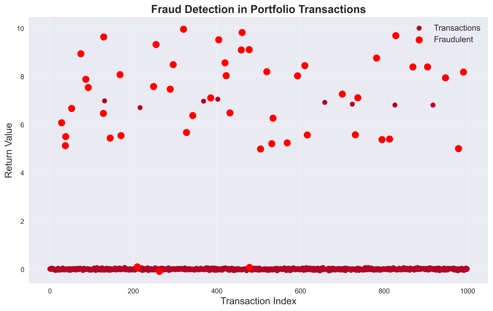

# Fraud Detection in Portfolio Transactions

This project implements **fraud detection** using Isolation Forest to identify anomalies in transaction data for a 20-stock portfolio.

- **Objective**: Detect fraudulent transactions with a 5% anomaly rate.
- **Methods**: Isolation Forest with portfolio optimization.
- **Output**: Visualization of normal and fraudulent transactions.
- **Visualizations**:
  - Fraud Detection Plot: 
- **Technologies**: Python (NumPy, Pandas, Matplotlib, Scikit-learn), yfinance API
